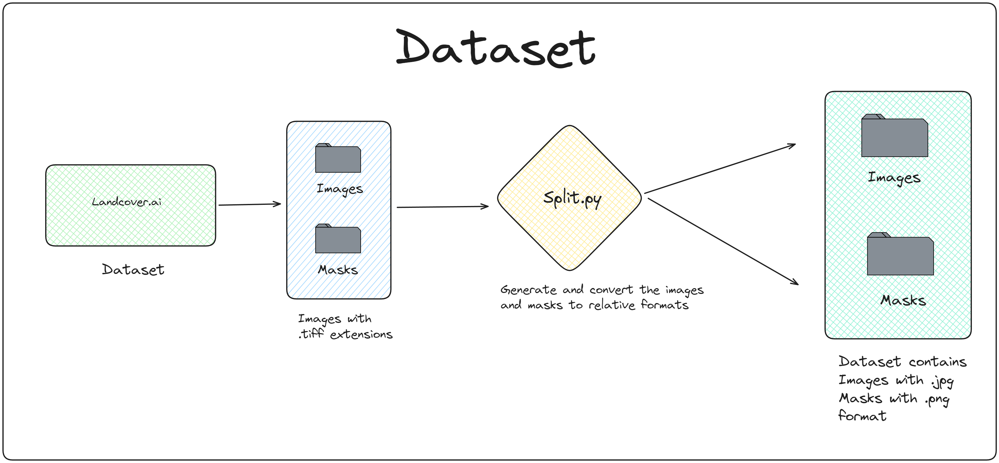
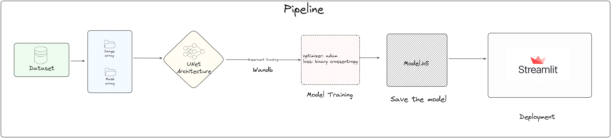

# MLOps Pipeline Project Report

## Introduction

This report outlines the implementation details and objectives achieved within the MLOps pipeline project. The project focuses on developing a robust machine learning pipeline employing industry-standard practices and tools.

## Project overview

The project aims to build an end-to-end MLOps pipeline incorporating data preparation, model training, validation, model registry, experiment tracking, inference dashboard development, drift detection, and Docker Compose deployment.

## Task 1: Training Pipeline Development

This is the dataset prepration for the project. 

- The dataset consists of folders called `images` and `masks` these are in the format of '.tiff'. Usually Tiff image file types can hold multiple images.
- There are 41 tiff files in the each folder, after extracting
- It generated upto 20100 images.
- The images are in `.jpg` format and masks are in `.png` format.

1. **Dataset** - The dataset that contains images and relative masks we stored in a array.

2. **Unet Architecture** - This architecture is a U-Net based neural network designed for image segmentation tasks. It consists of encoding layers followed by a bottleneck and decoding layers for feature extraction and reconstruction. Each encoding step reduces spatial dimensions, while decoding steps upsample and concatenate features for precise localization. Batch normalization and dropout layers are used for regularization, ending with a sigmoid activation for pixel-wise classification into three channels, commonly used for image segmentation into classes.

3. **Wandb** - Weights & Biases (wandb) tracking is a versatile tool that facilitates real-time visualization and logging of model training metrics, hyperparameters, and system-level performance, enabling comprehensive experiment tracking and analysis for enhanced model iteration and optimization.

4. **Model Training** - Train the model with optimizer as `adam`, loss as `binary_crossentropy` for 50 epochs.

5. **Saving the model** - Save the model in `.h5` format for the furture use and inference. 

## Task 2: Experiment Tracking and Model Registry Integration

**Wandb** - Weights & Biases (wandb) tracking is a versatile tool that facilitates real-time visualization and logging of model training metrics, hyperparameters, and system-level performance, enabling comprehensive experiment tracking and analysis for enhanced model iteration and optimization.

[Tacking]('https://wandb.ai/mohankrishce/MLOPS?workspace=user-mohankrishce')

## Task 3: Inference Dashboard Development

**Objective**: Developed a user-friendly inference dashboard using Streamlit.

**Implementation**: Created an intuitive user interface for model inference and results visualization.

**Results**: Delivered a user-friendly dashboard to interact with the trained models.

## Task 4: Drift Detection Implementation

**Objective**: Implemented a drift detection mechanism to monitor data distribution changes.

**Implementation**: Utilized standard drift metrics like Cross-Entropy, KL Divergence for deviations from the training data distribution.