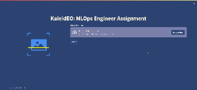
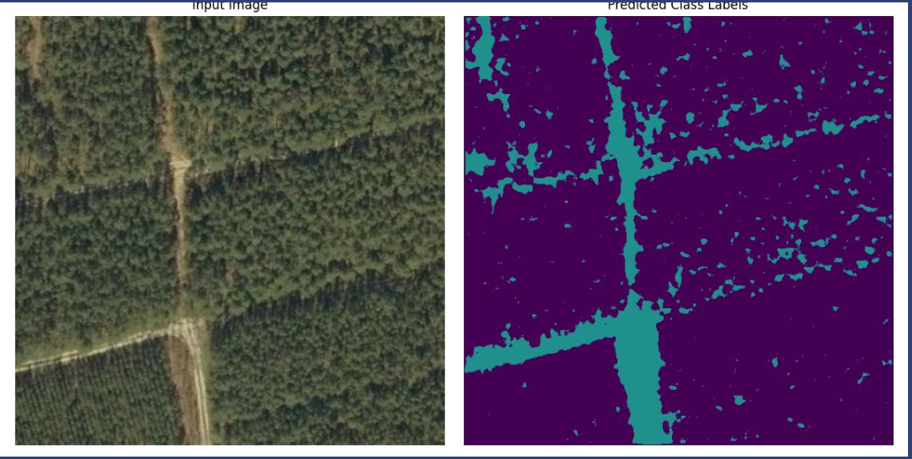
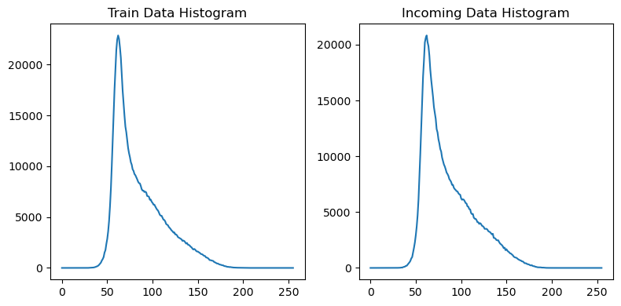
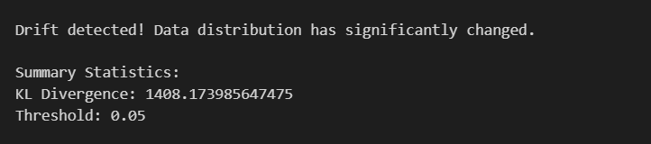

# Streamlit Application 

## 1. Streamlit Application:

**Overview**: Developed a Streamlit-based user interface for intuitive model inference and visualization.

### Implementation Details:

User Interface: Created interactive elements for users to input data and visualize model predictions.
Integration: Incorporated model loading and prediction functionalities within the Streamlit app.
Visualization: Enabled the display of model outputs or classification results for user-friendly interpretation.
When we give a image input, it generated to the segmentated output. 

### User Experience Optimization:
Iteratively refined the interface to enhance user experience and clarity in displaying model outputs.

# Drift Detection 

## 1. Methodology Overview:

**Objective**: The implemented drift detection mechanism aims to quantify changes in data distribution between a reference dataset (train_data) and incoming data (incoming_data).
Approach: Utilizes the Kullback-Leibler (KL) Divergence metric to measure dissimilarity between histograms of pixel values in the datasets.

## 2. Implementation Steps:

**Data Loading & Preparation**:

Loaded reference and incoming image data using OpenCV.
Flattened image arrays for histogram computation.

**Histogram Generation**:

Computed histograms for both datasets to represent pixel value distributions.
Visualized the histograms for reference and incoming data for qualitative inspection.

**KL Divergence Calculation**:

Calculated KL Divergence using the computed histograms to quantify the divergence between the distributions.

**Threshold-based Drift Detection**:

Compared the calculated KL Divergence against a predefined threshold to determine drift presence.
Threshold set at 0.05, subject to adjustment based on specific application requirements.

## 3. Visualization:

**Histogram Plots**:

Displayed side-by-side histograms for reference and incoming data to visualize distribution differences.

## 4. Results & Interpretation:

**Drift Detection Outcome**:

Evaluated whether drift was detected based on the computed KL Divergence exceeding the threshold.
Provided a binary determination: "Drift detected" or "No significant drift detected."

